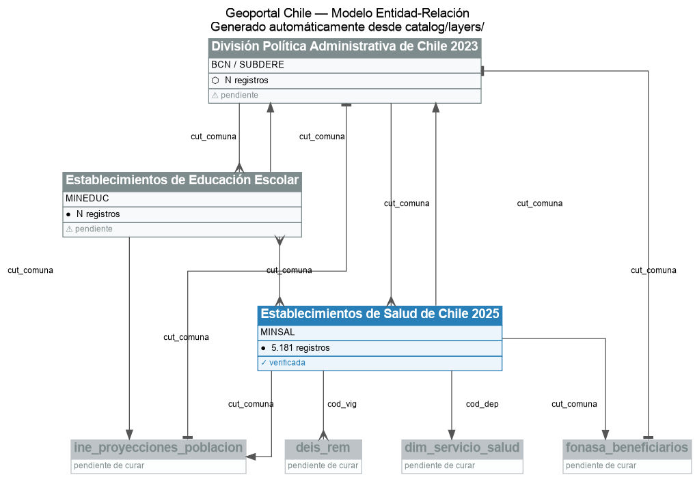

# Geoportal Chile — Explorador de Capas y Relaciones

> Herramienta open-source para explorar, entender y descargar datos geoespaciales del Estado de Chile, dirigida a usuarios sin formación técnica en GIS.

---

## Misión

Hacer accesible el valor práctico de los datos del [Geoportal IDE Chile](https://geoportal.cl) para personas y organizaciones que no son expertas en GIS ni en programación: funcionarios públicos, consultores, periodistas de datos, municipios, investigadores, estudiantes.

El Geoportal IDE ya publica cientos de capas de información oficial del Estado. El problema no es la disponibilidad de los datos — es que son difíciles de entender, relacionar y usar. Este proyecto actúa como **capa de interpretación**: documenta qué significa cada columna en lenguaje simple, expone las relaciones entre datasets de distintos organismos, y permite descargar subconjuntos útiles sin escribir una sola línea de código.

## Visión

Un catálogo curado de capas del Geoportal donde cualquier persona pueda:

1. **Explorar** un diagrama entidad-relación (ER) interactivo que muestra cómo se conectan los datos de salud, educación, territorio y demografía a través del CUT (Código Único Territorial).
2. **Entender** qué significa cada campo en términos prácticos, con ejemplos reales y contexto de uso.
3. **Descargar** subconjuntos filtrados (por región, comuna, tipo) en formatos listos para Excel, QGIS o Python, sin necesidad de conocer WFS ni GeoServer.

## Principios de diseño

- **Curaduría sobre exhaustividad**: 10–15 capas de alto impacto bien documentadas valen más que 500 mal explicadas.
- **Sin reinventar la rueda**: los datos viven en el Geoportal. Este proyecto solo agrega documentación, relaciones y una interfaz amigable.
- **El CUT como hilo conductor**: el Código Único Territorial (SUBDERE) es la clave foránea universal del Estado chileno. Toda relación entre datasets pasa por él.
- **Valor práctico primero**: cada capa debe tener al menos un ejemplo concreto de uso ("con esta capa puedes saber cuántos CESFAM hay por cada 10.000 habitantes en tu región").

## Capas contempladas (primera versión)

| Sector | Dataset | Organismo |
|--------|---------|-----------|
| Salud | Establecimientos de Salud 2025/2026 | MINSAL |
| Salud | Servicios de Salud (29 servicios) | MINSAL |
| Educación | Establecimientos Escolaridad | MINEDUC |
| Educación | Jardines Infantiles | Fundación Integra |
| Territorio | División Política Administrativa 2023 | BCN / SUBDERE |
| Demografía | Proyecciones de Población por Comunas | INE |
| Salud pública | Beneficiarios FONASA por Comuna | FONASA |
| Producción | DEIS REM (consultas, urgencias, hospitalizaciones) | DEIS / MINSAL |

## Stack tecnológico

- **Backend**: Python + FastAPI — proxy WFS, caché de datos, documentación de esquemas, filtros server-side
- **Frontend**: interfaz web ligera (JavaScript) con mapa interactivo (Leaflet) y diagrama ER (D3 o similar)
- **Datos**: consumidos en tiempo real desde el GeoServer del Geoportal vía WFS; complementados con CSVs de INE, FONASA, DEIS
- **Despliegue**: contenedor Docker, pensado para auto-hospedaje o plataformas cloud simples

## ¿Qué NO es este proyecto?

- No reemplaza al Geoportal IDE ni a QGIS.
- No almacena copias permanentes de los datos oficiales.
- No es un visor WMS general (para eso el Geoportal ya funciona bien).
- No pretende cubrir todas las capas del Geoportal en su primera versión.

## Diagrama ER actual

El diagrama se genera automáticamente desde los YAMLs del catálogo. Los nodos en azul están curados y verificados; los grises están pendientes; los punteados son capas referenciadas pero aún sin documentar.



## Inicio rápido

```bash
# 1. Construir imagen (solo la primera vez)
docker compose build

# 2. Generar el diagrama ER (PNG + JSON)
docker compose run --rm build-er

# 3. Verificar si alguna capa cambió de esquema en el geoportal
docker compose run --rm schema-check

# 4. Descubrir columnas de capas pendientes de curar
docker compose run --rm schema-check --discover
```

Los archivos generados quedan en `catalog/`:
- `er_model.png` — diagrama para visualizar y compartir
- `er_model.json` — grafo estructurado (base del futuro frontend)
- `snapshots/<capa>.json` — estado verificado de cada esquema

## Estructura del repositorio

```
catalog/
  layers/          ← YAMLs curados (uno por capa, editados a mano)
  snapshots/       ← estado verificado de cada esquema WFS
  er_model.png     ← diagrama generado
  er_model.json    ← grafo generado
scripts/
  build_er_model.py     ← genera PNG + JSON desde los YAMLs
  check_schema_drift.py ← detecta cambios de esquema en el geoportal
Dockerfile.tools
docker-compose.yml
GEOPORTAL.md       ← referencia técnica del ecosistema geoportal.cl
```

## Documentación técnica

Ver [GEOPORTAL.md](GEOPORTAL.md) para referencia técnica detallada: estructura de capas, operaciones WFS, mapa de relaciones, problemas conocidos y ejemplos reales de consulta.

---

*Proyecto comunitario, no afiliado oficialmente al IDE Chile ni a ningún organismo del Estado.*
